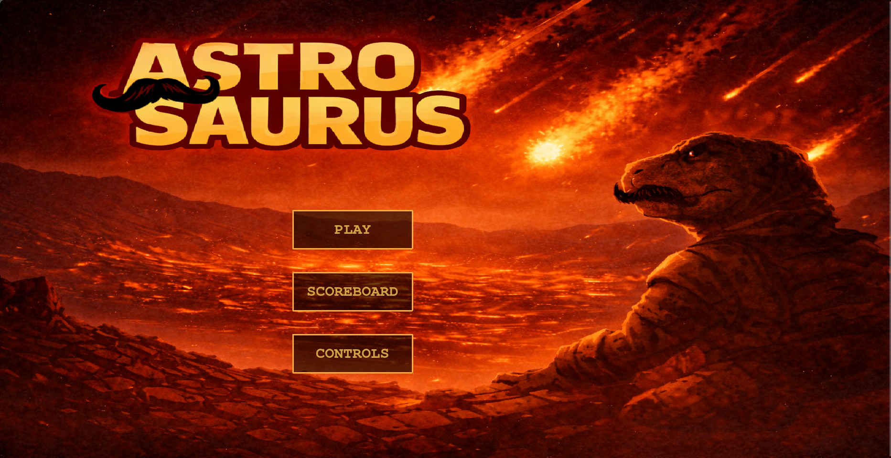
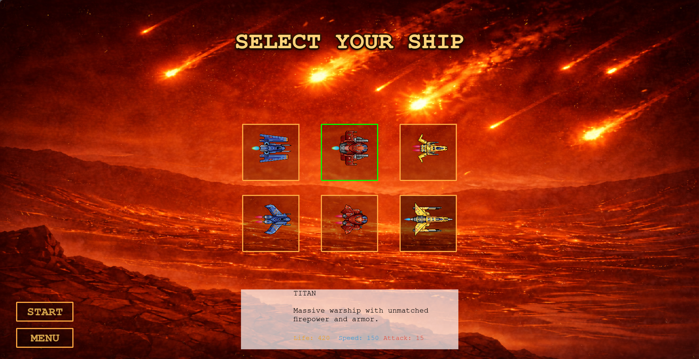
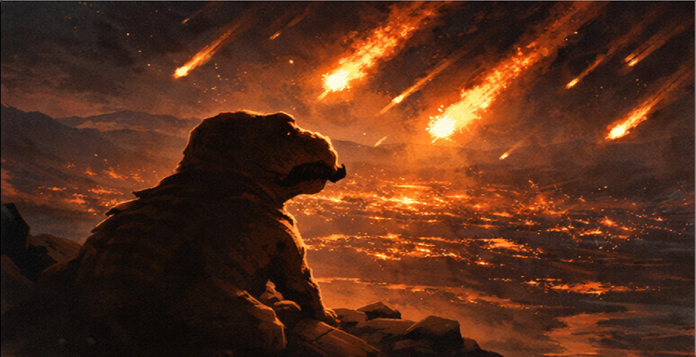
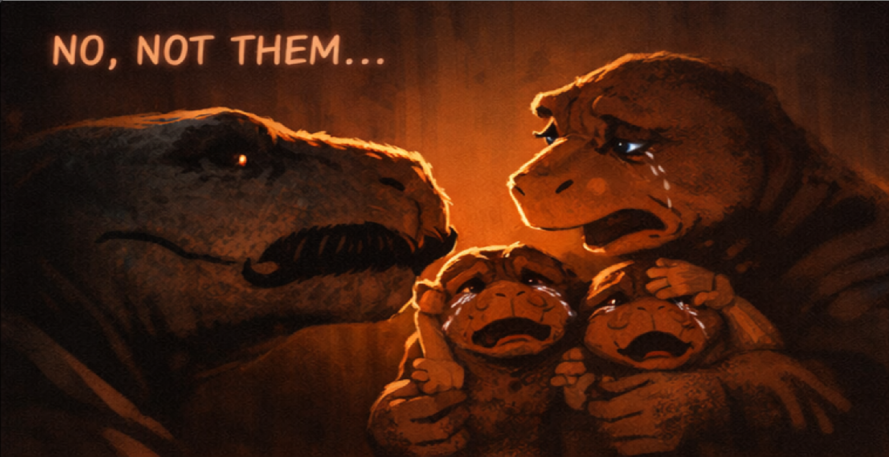
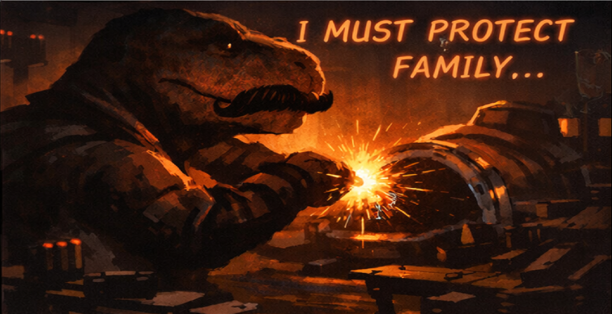
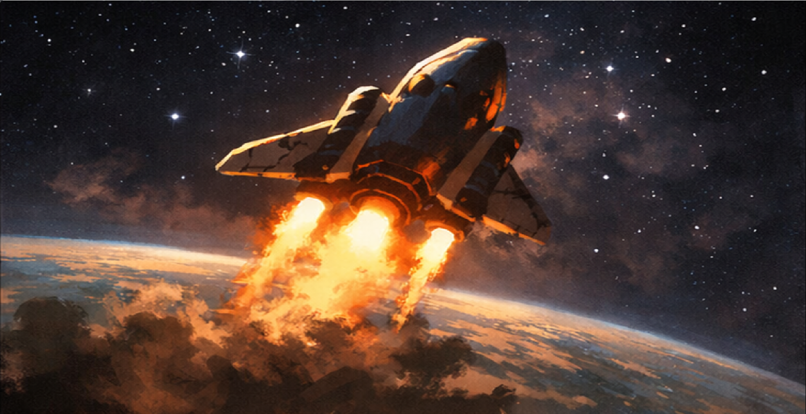
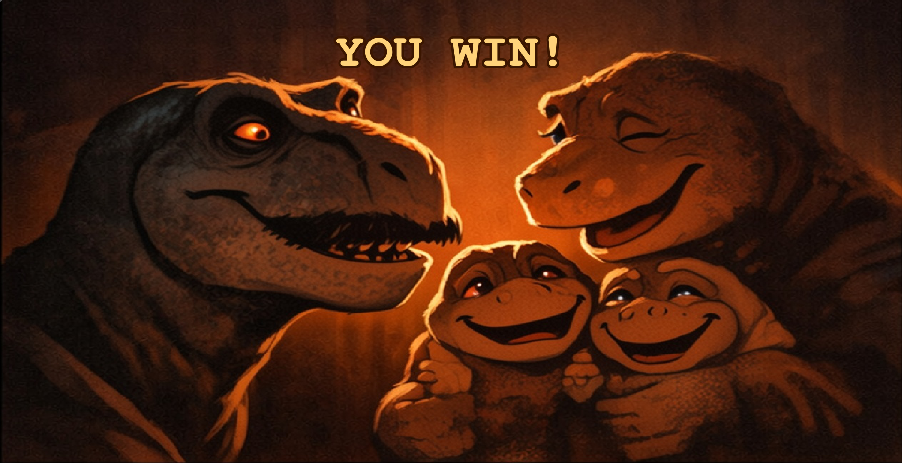
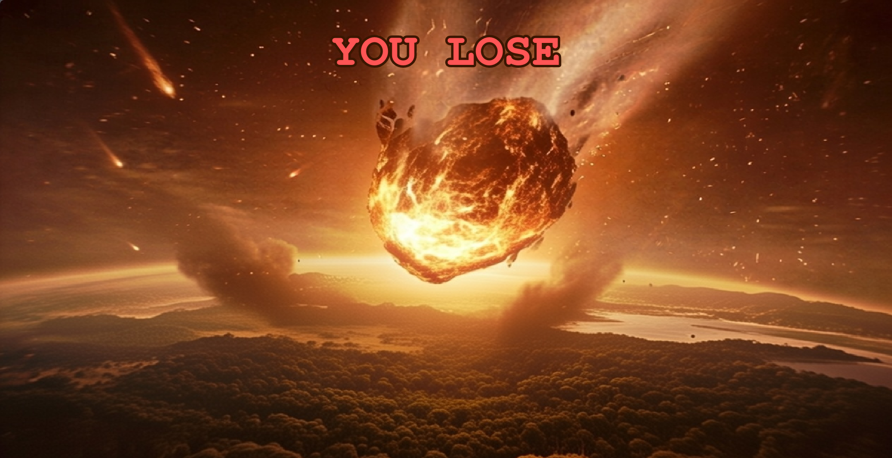

# 🦖 AstroSaurus

A browser-based arcade shooter built with **TypeScript** and **Phaser**, where a spacefaring dinosaur must defend Earth from the incoming Chicxulub asteroid and prevent the extinction of dinosaur life.

🎮 **Play Online:** https://jurassicimpact.github.io/

---

### Main Menu



### Ship Selection



### Intro Story Sequence

<table>
  <tr>
    <td></td>
    <td></td>
  </tr>
  <tr>
    <td></td>
    <td></td>
  </tr>
</table>

### Gameplay

[GIF_PLACEHOLDER_GAMEPLAY]

### Victory & Defeat Screens

<table>
  <tr>
    <td align="center">
      <strong>Victory</strong><br/>
      
    </td>
    <td align="center">
      <strong>Defeat</strong><br/>
      
    </td>
  </tr>
</table>

---

## About

AstroSaurus reimagines the famous extinction event through an arcade-style experience where dinosaurs fight back against their fate.

Players choose a spaceship, navigate through incoming asteroid fields, protect Earth, and destroy the Chicxulub asteroid before it wipes out life on the planet.

The project was developed collaboratively using **TypeScript**, **Phaser**, and **GitHub Pages**.

---

## Features

* 🚀 Multiple playable spaceships with unique statistics
* 🦖 Story-driven intro sequence
* ☄️ Real-time asteroid combat
* ❤️ Player, Earth, and asteroid health systems
* 🎵 Custom music and sound effects
* 🏆 Persistent local scoreboard
* ⏸️ Pause system
* 🎨 Custom UI, menus, and visual presentation
* 🌍 Browser-playable deployment

---

## Gameplay

### Objective

Protect Earth while damaging the Chicxulub asteroid.

The player loses if:

* Earth's health reaches zero
* The player's ship is destroyed

The player wins if:

* The Chicxulub asteroid is destroyed before Earth falls

### Controls

| Key   | Action      |
| ----- | ----------- |
| W     | Move Up     |
| A     | Move Left   |
| S     | Move Down   |
| D     | Move Right  |
| SPACE | Fire Weapon |
| ESC   | Pause       |

---

## Technical Overview

The project is built around Phaser scenes that separate responsibilities across different gameplay systems.

### Scene Architecture

* Main Menu
* Controls Screen
* Ship Selection
* Intro Cutscene
* Gameplay Scene
* Pause Menu
* Scoreboard
* Ending Screens

### Core Systems

#### Object Pooling

Bullets and asteroids use pooling systems to avoid continuous object creation and destruction during gameplay, improving runtime performance.

#### Collision System

Gameplay interactions are driven through collision handling between:

* Player ship
* Asteroids
* Projectiles

This allows damage calculation, score tracking, and gameplay events to remain modular.

#### Score System

Scores are stored locally using browser storage and displayed through an in-game leaderboard.

#### Audio Management

Dedicated audio handling manages:

* Menu music
* Gameplay music
* Sound effects
* Win/Loss audio feedback

---

## My Contributions

I worked primarily on the game's presentation, player experience, and frontend systems, including:

### UI & Menus

* Main menu implementation
* Controls screen
* Scoreboard interface
* Pause menu interactions
* End-game screens

### Visual Direction

* Asset selection and visual consistency
* AI-assisted artwork curation and refinement
* Ship presentation and selection screen
* Interface styling and animations

### Narrative Experience

* Intro story sequence
* Story slide presentation
* Victory and defeat flows

### Audio

* Music selection
* Sound effect integration
* Audio feedback for gameplay events

### Gameplay Features

* Ship selection interface
* Ship descriptions and stat presentation
* Final score presentation and leaderboard flow

---

## Team

### @jomunoz42

Frontend implementation, UI systems, menus, ship selection experience, score systems, story presentation, visual direction, audio integration, and overall player experience.

### @zico15

Project architecture, gameplay systems, deployment, Git workflow organization, and cross-project integration.

### @RubensTFJ

Spaceship shooting mechanics and asteroid collision systems.

### @olacerda

Story presentation support, subtitle implementation, and narrative asset integration.

---

## Installation

Clone the repository:

```bash
git clone https://github.com/jomunoz42/AstroSaurus.git
```

Install dependencies:

```bash
npm install
```

Run locally:

```bash
npm run dev
```

Build for production:

```bash
npm run build
```

---

## Technologies

* TypeScript
* Phaser
* Vite
* HTML5
* CSS
* GitHub Pages

---

## Acknowledgements

This project was created as a collaborative game development experience combining gameplay programming, UI design, storytelling, audio integration, and browser deployment.
